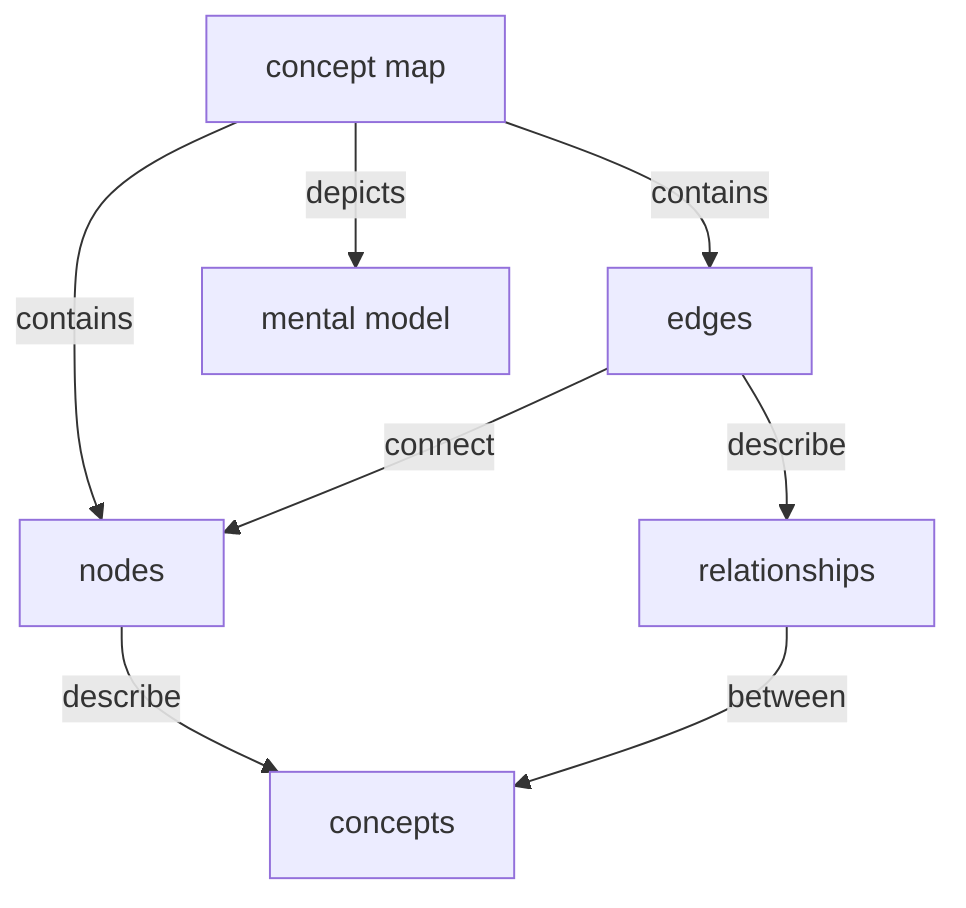

:::info
Users are expected to follow **[The Carpentries Code of Conduct](https://docs.carpentries.org/topic_folders/policies/code-of-conduct.html)**.

All content is publicly available under the [Creative Commons Attribution License](https://creativecommons.org/licenses/by/4.0/).
:::

**Lesson Title:** FIXME. No title has been decided yet. Candidate options based on the content so far: *"Choosing an Open Source License,"* *"Open Source Licensing for Research Software,"* *"License It Right."* Pick one, or none of these. Just flagging that this is still open.

<!-- inserts a Table of Contents: don't change the line below -->
[TOC]

## Target Audience

People who have already written or are hosting software (usually a research project) and want to share it, but don't know how licensing works. Not novices to writing code, novices to licensing specifically.

Real-world framing from Laura: this is the same audience that shows up at OSPO intake already holding a project, asking "which license should I use?" There's a fork in how that question gets answered depending on IP ownership: if the code belongs to the UC, the answer routes through TTO; if it doesn't, the answer is closer to walking someone through choosealicense.org.

### Notes

Compiled from the group's Day 1 discussion (Karla, Reid, Laura, Jose):

- They already have working software and a specific reason to share it, or are close to that point.
- They may have a vague sense that licenses matter, or have heard terms like "permissive" or "copyleft" without a clear grasp of what those mean in practice.
- Their goal by the end of the lesson: enough understanding and confidence to select an appropriate license for their own project, not just memorize a list of license names.
- A related, not-yet-fully-explored audience: people who want the philosophy behind the choices, not just a decision chart. Worth a note for scope, not necessarily building for in this first version.

### List of prerequisite knowledge

Agreed by the group:
- No licensing knowledge required, this is the starting point of the lesson.
- Some basic understanding of what open source software is, helps but isn't strictly required, since the lesson can open with the basics.

## Lesson Learning Objectives

FIXME: this is Laura's synthesis from Day 1's group review (Jose, Karla, and Reid all reviewed it favorably), plus Jose's suggested addition. Treat this as the strong starting point it is, but it hasn't been formally locked in as a team.

### Learning Objectives
After following this lesson, learners will be able to:

- Describe what an open source license is
- Describe an example of what can happen if a license isn't applied to a project
- Identify the difference between permissive and non-permissive (copyleft) licenses, with an example of each
- List the most common open source licenses
- Describe an example of what can happen when a project's dependencies' licenses clash
- Choose a license for an example project and explain why that's the right choice

### Notes

- This list went through peer review on Day 1 (each team member reviewed someone else's draft against the SMART criteria). The main critique that came back, from Jose reviewing Karla's earlier draft, was that "state the rights every OS license grants" was too broad to be attainable; the version above sidesteps that by keeping each objective scoped to one concrete skill.
- The "list the most common licenses" objective wasn't in anyone's original individual draft; it emerged from Jose's review of Laura's list, flagging that naming specific licenses (MIT, GPL, Apache, etc.) was implied by the other objectives but never stated outright.

## Data Set/Narrative

FIXME: this is a **compiled draft, not a team decision**. Four people wrote four narrative fragments overnight; none of them is complete on its own, but they aren't actually in conflict; they're describing the same shape from different angles. Use this as the starting point for Friday morning's "Share Your Narrative Threads" discussion, not as the answer.

**What each person proposed:**

- **Jose**: a structured, multi-episode approach: open with one example group and their software, ask the audience what they should do about licensing, walk through consequences of skipping it, then work through common licenses one by one against that group's situation. A second episode repeats the pattern with a different group/context. A final exercise has learners choose a license for a brand-new scenario on their own.
- **Laura**: 2-3 fictional maintainer personas (a researcher, a student, IT staff), each with a project and a reason they're confused about which license to pick.
- **Karla**: two contrasting researcher scenarios: one who wants to release all their code openly, one doing a partial ("COSS") release, open-sourcing some but not all of a project. Both scenarios motivate a discussion of license tradeoffs.
- **Reid**: a partial thought, not yet developed: that writing code/scripts/software is necessary for most research projects sharing data or code, which could be the throughline explaining *why* this audience needs this lesson at all.

**The synthesis these are pointing at:** a small set of persona-based scenarios (2-3, per Laura's and Karla's independent counts), each representing a different real licensing situation, used as running examples across the episodes Jose's structure implies. Reid's fragment could work as the lesson's opening motivation (why does a researcher with code end up needing to think about licensing at all?) rather than as a separate scenario.

**Open questions for Friday:**
- How many personas: 2 (Karla's count) or 2-3 (Laura's count)?
- Does the "full release vs. partial/COSS release" split (Karla) become the throughline, or do the personas vary along a different axis (researcher vs. student vs. staff, per Laura)?
- Where does the IP-ownership fork Laura mentioned (UC-owned code routes to TTO) fit; is that in scope for this lesson, or a follow-up "real world" note?

## Episodes

FIXME: draft grouping of the objectives above into 4 candidate episodes, worked out during Day 2 planning. Not final; the team should feel free to regroup, split, or reorder.

| Episode | Objectives it covers |
|---|---|
| 1: Why License Your Code? | What is a license; consequences of no license |
| 2: Permissive vs. Copyleft | Permissive vs. copyleft differences; common licenses |
| 3: When Licenses Clash | Consequences of dependency license clashes |
| 4: Choosing Yours | Choose a license for an example project, explain why |

Episode 4's capstone decision exercise is a natural fit for whichever persona narrative the team lands on Friday: "given [persona]'s project, which license and why?"

### Episode Learning Objectives
FIXME: each collaborator drafts SMART objectives for their assigned episode during Friday's exercise. Not pre-filled here; that's deliberately live work.

#### EPISODE TITLE
After following this episode, learners will be able to:

* objective 1
* objective 2
* ...
* objective N

## Designing Exercises
FIXME: draft exercises during Friday's "Designing Exercises" session. One thing worth carrying in from Thursday: licensing is a misconception-rich domain ("no license means public domain," "permissive means anything goes," "copyleft is viral"), so multiple choice questions with a real misconception as the wrong answer, not just any incorrect statement, will do useful diagnostic work here.

### Examples before exercises
FIXME: draft during Friday's session, once a narrative is settled. Once you've picked your persona(s), each exercise's worked example should draw from that same persona's project.

## Glossary of terms
FIXME: add a list of terms or jargon from your lesson, along with their definitions.
The syntax below will make your glossary render nicely when added to the `learners/reference.md` page of your lesson.

Term 1
: Definition 1
  add more lines here
  if you need to
  but indent them
  by two spaces
  each time

Term 2
: Definition 2
  and so on...

*Terms already surfaced in discussion that will likely need definitions: permissive license, copyleft, OSI-approved, dependency, license compatibility/clash, COSS (closed open source software, per Karla's usage).*

## Completing lesson metadata
FIXME: add questions and key points that summarise the most important messages of your episodes below.
We typically aim to write the key points as answers to the questions.
An episode typically answers 1-3 questions.

### Episode Title
#### Questions
* What question will be answered by keypoint 1?
* What question will be answered by keypoint 2?
* etc.

#### Key Points
* This is the answer to question 1.
* This is the answer to question 2.
* etc.

---

## Additional Design Notes

- IP-ownership fork (Laura): whether the code belongs to the UC changes the advice given (TTO vs. choosealicense.org walkthrough). Decide whether this is in scope for the lesson itself or a "real world" callout.
- A third audience segment mentioned but not yet built for: people who want the philosophy behind license choices, not just a decision procedure (Laura). Parked, not pursued in v1.

## Concept Maps

Concept maps are a useful tool for describing the relationships between concepts. They can be used to visualise one's mental model of a topic. You can use this section to add concept maps that illustrate the design of your lesson and/or the most important information you are trying to communicate in your lesson/its episodes.

You can embed a photo or other image file, or use the [Mermaid.js](https://mermaid.js.org/) syntax demonstrated below.

*Heads up: mermaid diagrams did not render in CodiMD's slide/presentation mode when we tried this earlier in the training, though they may still render fine in the regular note view. Graphviz is confirmed working in slide mode though, so use that syntax instead if the concept map needs to show up in a live presentation.*

### Lesson Concept Map

You can put concepts maps for the whole lesson here...

### Episode Concept Maps

...and concept maps for individual episodes here.

:::info
General questions or feedback? Contact [team@carpentries.org](mailto:team@carpentries.org).
:::
