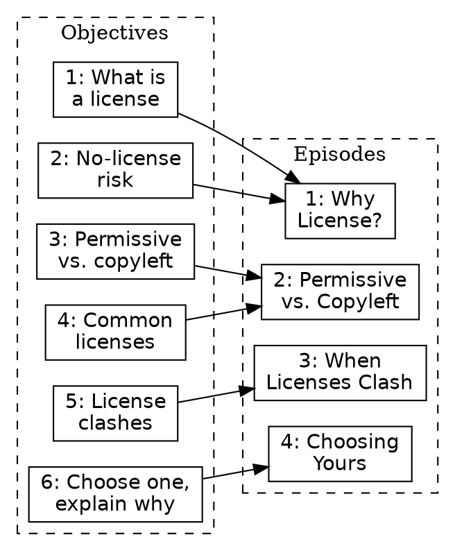
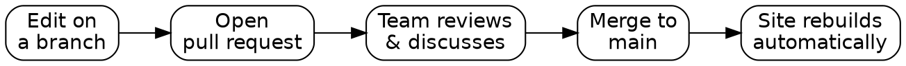

## Day 2 - Live Content (Fri 8/28)

| Time (PT) | Block |
|---|---|
| 9:00 | Start / yesterday recap |
| 9:00-9:20 | Share Narrative Threads |
| 9:20-10:25 | Episodes |
| 10:25-10:40 | Break |
| 10:40-12:00 | Designing Exercises |
| 12:00-1:00 | Lunch |
| 1:00-2:10 | The Carpentries Workbench |
| 2:10-2:25 | Break |
| 2:25-3:30 | Adding Lesson Content |
| 3:30-3:55 | Wrap-up |
| 3:55-5:00 | End early / buffer |

*We're doing less today, on purpose. Three full episodes are cut entirely, not trimmed: How We Operate, Preparing to Teach, and How to Write a Lesson. All three move to standing Tuesday meetings, full content in the appendix. ~325 min of scheduled content against the 480-min window, leaving about 65 min of real slack at the end, genuine room to end early, not something to fill with appendix content. Lunch is fixed at noon-1:00; if a block before it runs long, cut it short rather than pushing lunch later.*

### Share Your Narrative Threads

Each team shares the candidate narrative/use-case thread from overnight. Not a finished answer, something to react to as a group.

**What You Each Proposed Overnight**

- **Jose**: structured multi-episode approach: intro example group, ask what they should do about licensing, walk through consequences, then common licenses one by one. A second episode repeats it with a different context. Final exercise: choose for a new scenario.
- **Laura**: 2-3 fictional maintainer personas (researcher, student, IT staff), each confused about which license to pick.
- **Karla**: two contrasting researcher scenarios: full open-source release vs. partial ("COSS") release.
- **Reid**: writing code is necessary for most research projects sharing data or code, a possible opening motivation rather than a separate scenario.

**These aren't competing, they're the same shape**: persona-based scenarios illustrating different licensing situations, run through the episode structure Jose outlined.

Open for today:
- How many personas: 2 or 2-3?
- Throughline: full-vs-partial release (Karla), or personas varying by role (Laura)?
- Does Reid's "why does this audience need this lesson" fit as the opener?

*The IP-ownership fork Laura mentioned (UC-owned code routes to TTO) is a real-world detail worth a call-out but is a scope decision, not something to resolve in this slot.*

---

### Episodes _(target start: 9:20)_

#### Overview
##### Questions
- How can the objectives for a lesson be used to break its content into sections?
- How should objectives be written for a smaller part of a whole lesson?

##### Objectives
After completing this episode, participants should be able to...
- identify appropriate parts of their lesson to break into individual sections
- define learning objectives for a section of a lesson.

#### Worked Example: Your Objectives → Episodes

Laura's 6-objective synthesis from yesterday, grouped into 4 candidate episodes:



*Starting point, not the answer. The team should feel free to regroup, split, or reorder. Episode 4's capstone decision exercise is a natural fit for the persona narrative: "given [persona]'s project, which license and why?"*

::: success
#### Exercise: Defining Episodes for a Lesson (25 minutes)

With your team, in the shared notes document for your lesson:

1. Based on the lesson-level objectives and your knowledge of the lesson topic, divide the lesson up into logical blocks (episodes), that should each take approximately 20-60 minutes to teach.
2. Assign responsibility for one of these episodes to each collaborator in your team. They will focus on this episode for the rest of this training.

**We strongly recommend assigning yourselves consecutive episodes at the beginning of your lesson.**
:::

::: success
#### Exercise: define objectives for your episode (30 minutes)

1. Using the same approach as you did for your whole-lesson objectives, define a set of SMART objectives for your chosen episode. (15 minutes)
2. Compare your list with those created by your collaborators on the lesson:
    - are there any gaps in these objectives, i.e. anything that should be covered in these episodes but is not captured in the objectives?
    - are there any overlaps, i.e. anything that looks like it will be covered more than once?
3. As a group, discuss how you will address any problems identified in the previous step, and edit your objectives accordingly.
:::

#### Key Points
- Learning objectives for a lesson can help you split up its content into chunks.


---

### Designing Exercises _(target start: 10:40)_

#### Overview
##### Objectives
After completing this episode, participants should be able to...
- Describe the importance of regular assessment while a lesson is being taught.
- Choose the format for an exercise based on the outcome it is intended to measure.

##### Questions
- How can you measure learners' progress towards your lesson objectives?
- Why are exercises so important in a lesson?
- What are some different types of exercises, and when should they be used?
- Why should we create assessments before we have written the explanatory content of our lesson?

#### Summative vs. Formative Assessment

- **Summative**: used *after* instruction to verify learning. Not usually a fit for short courses.
- **Formative**: used *during* instruction, moves new information into long-term memory, lets instructors adjust pace and address misconceptions in real time.

Formative assessment tools: checking in (Zoom reactions), group discussion (think/pair/share), problem-solving or diagnostic exercises, individual guided reflection.

::: success
#### Exercise: Formative Assessments in this Training (5 minutes)
Think back through the parts of this training you have followed so far. Identify two examples of formative assessment your Trainer has used, and what objective each was checking.
:::

::: success
#### Exercise: Exercise Types and When to Use Them (15 minutes)

Your group gets assigned an exercise type. Read about it, then discuss:
- What skills would this type assess (action verbs)?
- Better fit for novice or more advanced learners?
- Better for live workshop or self-directed/virtual learning?

Read the type assigned to you in [_Is This a Trick Question?_](https://cdm16884.contentdm.oclc.org/digital/collection/p16884coll42/id/147):
- multiple choice (page 13)
- true-false (pages 20 & 21)
- fill-in-the-blank (page 34)
- authentic assessment (pages 46 & 47)

**Use this non-coding branch, not the coding-lessons branch** (faded examples, Parsons problems). Licensing has no code.

Share the major points of your discussion in the collaborative notes document.
:::

#### Detecting Misconceptions

Correcting a misconception is as important as presenting new information: a broken mental model actively resists new knowledge until it's fixed. Well-designed multiple choice questions can diagnose misconceptions directly: each wrong answer should represent a plausible, real misconception, not just an obviously-wrong distractor.

*Licensing is a misconception-rich domain: "no license means public domain," "permissive means I can do literally anything," "copyleft is 'viral'" are all common, all wrong, and exactly what a well-built MCQ's wrong-but-plausible answers can catch. Carry this framing into the exercise below: design wrong answers around a real misconception, not just any incorrect statement.*

::: success
#### Exercise: Assessing Progress Towards an Objective (30 minutes)

Using one of the exercise formats you have learned about so far, design an exercise that will require learners to perform one of the actions described in the objectives you wrote earlier, and that assesses their ability to do so.

Given the clock, work together on **one shared exercise** rather than splitting up.
:::

#### Key Points
- Assessments are a way to determine whether the objectives you defined for the lesson have been reached.
- Exercises help learners commit what they've learned to long-term memory.
- **Formative assessment** happens *during teaching* and provides feedback both to an instructor and a learner.


---


### The Carpentries Workbench _(target start: 1:00, after lunch)_

At this stage you're clear on audience, objectives, and your episode outline. Time to build the site.

#### Objectives
After completing this episode, participants should be able to...
- Identify the key tools used in The Carpentries lesson infrastructure.
- Complete the fundamental setup steps for a new lesson repository.
- Edit Markdown files using the GitHub web interface.

#### GitHub Pages + The Carpentries Workbench
Lesson sites are built with `{sandpaper}` + `{varnish}` + `{pegboard}` (the Workbench), hosted via GitHub Pages.

| Task | Frequency |
|---|---|
| Create repository | Once |
| Add collaborators | Rarely |
| Edit global config | Rarely |
| Create a new episode | Often early, rarely later |
| Edit episode content | Often |

#### Creating Your Lesson Repository

**A QUICK CHECK:** Are you in the [UC-OSPO-Network](https://github.com/UC-OSPO-Network) org? Team access is already staged (`licensing-and-copyright`).

**You're one team building one lesson: only one person creates the repo, not each of you separately.**

One volunteer: use the [Markdown template](https://github.com/carpentries/workbench-template-md/generate), this one, for Licensing (no code/data). Name the repo, check "Include all branches," Public visibility.

Then: add the new repo to the `licensing-and-copyright` team (org Settings → Teams → licensing-and-copyright → Repositories, or from the repo's own Settings → Collaborators and teams). That gives everyone access at once. Skip the curriculum's usual "Add collaborators" step; it's written for personal-account repos, not org-team ones. Paste the repo URL and rendered site URL into the shared CodiMD notes once, there's only one.

::: success
#### Practice with `config.yaml` (5 minutes)
Complete these fields, quoted FIXMEs get quoted replacements, unquoted stay unquoted:
- `contact`: an email people can reach with questions
- `created`: today's date, YYYY-MM-DD
- `keywords`: short comma-separated list, include `lesson`, `pre-alpha`
- `source`: your lesson repo's URL
:::

::: success
#### Improving the README.md (5 minutes)
Update with: the lesson title, a short description, author names (optionally linked to GitHub profiles).
:::

#### Key Points
- Lesson sites are built from source repositories with GitHub Pages.
- A new lesson repository can be created from a template maintained by The Carpentries.


---

### Adding Lesson Content _(target start: 2:25, after afternoon break)_

#### Objectives
After completing this episode, participants should be able to...
- Add lesson episodes as individual pages of a lesson website.
- Use _fenced divs_ to create different structural elements within a page.

#### Lesson Home Page (`index.md`)
Replace the template text with your lesson's short description (same as README), then add your lesson objectives as a bullet list.

#### Proposing Changes with Pull Requests
So far we've edited `main` directly. PRs add quality control, room for discussion, and prevent conflicting simultaneous edits.



*Instructor judgment call: if everyone's already comfortable opening PRs, skip the full walkthrough, check in with the group first.*

::: success
#### Practice with Pull Requests (10 mins)
Wrap your prerequisites list in a `prereq` fenced div, via a PR:

```markdown
::::::::::::::::::::::::::::::::: prereq

- prerequisite 1
- prerequisite 2
- [etc...]

::::::::::::::::::::::::::::::::::::::::
```
:::

::: success
#### Exercise: practice creating episodes (10 minutes)
Repeat the steps you just saw, to create another new episode file and add it to the lesson site navigation. Propose these changes as pull requests.
:::

*`config.yaml`'s `episodes:` list is the one file all four of you will want to touch around the same time, since everyone's adding their own filename to it. Expect a merge conflict here specifically. It's a small, low-stakes one to practice resolving rather than something to avoid.*

::: success
#### Exercise: Formatting Exercises in a Lesson Site (15 minutes)
Using `challenge` and `discussion` fenced divs (nest a `solution` inside a `challenge` for an expandable answer), format the exercise you designed earlier.
:::

#### More Fenced Div Types
- `callout`: important points that shouldn't be skipped
- `spoiler`: optional/tangential content, expandable
- `caution`: pitfalls or things that could cause problems

*If time remains: transfer more content from your Lesson Design Notes into the site, otherwise this rolls into homework.*

#### Troubleshooting the Lesson Build
If your site isn't updating: stop editing, check commit history for a red X, look at that diff, ask for help, or build locally for faster iteration.

*Skip point: if everyone's builds are green, skip this section entirely.*

#### Key Points
- The main pages of a lesson website are created from individual Markdown files in the `episodes` folder.
- Fenced div blocks format special structural elements, many types are available.
- Pull requests are how changes get reviewed before going live.


---

### Wrap-up _(target start: 3:30, hard stop 5:00)_

We've reached the end of live time. Iterative + collaborative: regular feedback refines the lesson, shared effort carries it past the finish line.

**What's Next for This Cohort, Specifically**
- Repo access is staged, pick up where you left off any time
- **Standing Tuesday meeting** (last 15-30 min) is your ongoing working session with Tim: covers everything cut from today (How We Operate, How to Write a Lesson, Preparing to Teach) plus checking in on the evolving lesson
- No fixed pilot or Incubator date yet, set your own pace as a team

::: success
#### One Up, One Down (10 minutes)
Feedback on this training, one thing that worked, one thing that didn't. One point each, try not to repeat what's already been said.
:::

Good luck, and keep in touch as you build out the lesson!

#### Key Points
- Although this training is over, your lesson development journey has only just begun.
- The Carpentries lesson development community offers support with the rest of the process.


---
---

## Appendix, Tuesday check-in material (not part of Friday's live flow)

*Everything below was cut from Friday to fit the clock. Work through it during the standing Tuesday meetings over the coming weeks, alongside checking in on how each lesson is evolving.*

---

### Tuesday Check-in Plan, 2:00-2:30pm PT

The `oss-license-workshop` repo is live with a real 4-episode structure (Jose: Why License?, Laura/Jose: Permissive vs. Copyleft, Karla: When Licenses Clash, Reid: Choosing Yours). Each 30-minute check-in pairs one week's real repo work with one appendix section below.

**Week 1: Fix what's blocking a working build**
- Rebase PR #5 (episode-2-permissive-vs-copyleft) onto `main`, fix its missing `.md` extension and unclosed challenge/solution divs (Laura, Jose)
- Fix `when-license-clash.md`'s `exercise:` front-matter typo (should be `exercises:`), turn its compatibility grid into a real Pandoc table with a solution (Karla)
- Retitle `choosing-licenses.md` (still says "Using Markdown"), replace its copy-pasted keypoints (Reid)
- Decide: delete or repurpose `introduction.md`, it's unedited scaffold and not even wired into `config.yaml`
- Appendix reference: *How We Operate*, sets the pace and expectations for this check-in series itself

**Week 2: Real content for Episodes 1 and 2**
- `why-license.md`: replace placeholder keypoints, add prose for the "license relates to copyright/IP" objective (Jose)
- Episode 2: replace the boilerplate body with real permissive/copyleft/weak-copyleft explanation and a real challenge (Laura, Jose)
- Appendix reference: *How to Write a Lesson*, explanatory-text and language-to-watch-for guidance applies directly here

**Week 3: Real content for Episodes 3 and 4, settle the persona**
- `when-license-clash.md`: replace `<!-- EPISODE CONTENT HERE -->` with real explanation, add a solution, real keypoints (Karla)
- `choosing-licenses.md`: turn the three sketched exercise ideas into one real capstone challenge/solution (Reid)
- Resolve the persona/narrative question left open from Friday (2 vs. 2-3 personas, which axis), Episode 4's capstone needs it
- Appendix reference: *How to Write a Lesson*, terminology and episode-metadata exercises

**Week 4: Support files**
- Port the glossary from `lesson-design-notes-licensing-draft.md` into `learners/reference.md`
- Simplify `learners/setup.md`, no software/data setup is actually needed for this lesson
- Write real `instructors/instructor-notes.md` and `profiles/learner-profiles.md`
- Appendix reference: *Preparing to Teach*, its setup/instructor-notes/feedback-plan exercises map directly to these files

**Week 5+: Toward a pilot**
- Re-run the `carpentries-workbench-checker` tool against the repo, confirm the Week 1-4 fixes cleared its findings
- Plan a pilot workshop, decide when to bump `life_cycle` past `pre-alpha`

---

### How We Operate (full) _(Tuesday Week 1)_

#### Objectives
After completing this episode, participants should be able to...
- Describe the role that feedback plays in the life cycle of a lesson.
- Connect with other members of the community.

#### The Lesson Life Cycle, Revisited
- pre-alpha/alpha/beta happen in **The Carpentries Incubator**
- Stable, peer-reviewed lessons live in **The Carpentries Lab**
- Life cycle stage is set in `config.yaml`'s `life_cycle` field, leave at `pre-alpha` for now

#### Pathways Out of Incubation
1. Join an existing lesson program (Library Carpentry, etc.), pending Curriculum Advisory Committee review
2. Submit to **The Carpentries Lab** for open peer review, with the option to publish in JOSE

No fixed timeline for this yet, pace is set by your group.

#### Pilot Workshops
*"No lesson survives first contact with learners.", Greg Wilson*

Track during your pilot: time per section/exercise, technical issues, questions asked, confusing parts. The [pilot workshop notes template](https://codimd.carpentries.org/lesson-pilot-observation-notes-template#) helps.

#### Connecting with the Community
- `lesson-dev` channel, [Carpentries Slack](https://slack-invite.carpentries.org/)
- [`incubator-developers`](https://carpentries.topicbox.com/groups/incubator-developers) mailing list
- GitHub Skill-up sessions, recommended if newer to collaborative GitHub

---

### How to Write a Lesson (full, deferred) _(Tuesday Weeks 2-3)_

#### Objectives
After completing this episode, participants should be able to...
- Estimate the time required to teach a lesson.
- Summarise the content of a lesson as a set of questions and key points.
- Connect the examples and exercises in a lesson with its learning objectives.

#### Writing Explanatory Text
Explanatory text is the train track connecting your exercises. It lets other instructors and self-directed learners follow along, and helps you stay on track teaching.

#### Less is More
- Trying to fit too much content into a lesson is counter-productive.
- Most Carpentries workshops are two work-days of material.
- Assume you're under-estimating time, not over-estimating.
- If cutting content after a pilot: remove whole objectives (and their assessments/content), not just trim text.

#### Language to Watch For
- Dismissive language ("simply," "just")
- Stereotypes
- Expert awareness gaps
- Inconsistent terminology
- Unexplained jargon, unexplained assumptions, sudden difficulty jumps

#### Accessibility
- Avoid regional/cultural idioms and contractions
- Alt text for all figures/images
- No h1 headers in the lesson body, no skipped heading levels
- Descriptive link text
- Check text/foreground contrast

::: success
#### Exercise: Examples Before Exercises (20 minutes)
Looking at an exercise you designed earlier: what worked example could you include in your narrative to prepare learners for it?
:::

::: success
#### Discussion: Lesson Time Management (10 minutes)
When has too much material for the time available happened to you? How did facilitators handle it?
:::

::: success
#### Optional Exercise: Alt Text for Images (5 minutes)
Given a chart of rising CO2 at Mauna Loa, which caption is the best alt text, vague, moderately descriptive, or a full data dump? *(Answer: moderately descriptive.)*
:::

::: success
#### Exercise: Explain Your Terminology (5 minutes)
List terms/jargon from your lesson with definitions, in your shared notes.
:::

::: success
#### Exercise: Completing episode metadata (10 minutes)
Add keypoints and questions for your episode.
:::

#### Key Points
- The objectives and assessments provide a good outline for an episode, then the text fills in the gaps.
- Review your lesson for demotivating language, cognitive load, and accessibility.

---

### Preparing to Teach (full, deferred to a standing meeting before your pilot) _(Tuesday Week 4)_

#### Objectives
After completing this episode, participants should be able to...
- Summarise lesson content as a teaching plan.
- Add Setup Instructions and Instructor Notes to the lesson site.
- Create a feedback collection plan.

#### Teaching Plan
Outlines your session: welcome/motivation, setup check, teaching + exercise segments, checkpoints, visual aids, references. **Checkpoints** are especially useful early on.

::: success
#### Exercise: Prepare a Teaching Plan (15 minutes)
Bullet-point notes on what you'll say and do teaching the episode you've been focused on. Can go straight into your Lesson Design Notes doc.
:::

::: success
#### Exercise: Add Setup Instructions (10 minutes)
If your lesson needs any software/tools/data, write clear setup instructions in `learners/setup.md`.
:::

::: success
#### Exercise: Add Instructor Notes (5 minutes)
Add initial notes to `instructors/instructor-notes.md`, plus one inline `instructor` fenced div in an episode.
:::

#### Feedback Collection Plan
Assign feedback-collection roles ahead of your pilot.
- Constantly, throughout: observer notes ([pilot notes template](https://codimd.carpentries.org/lesson-pilot-observation-notes-template#)), or minute-card feedback
- Designated wrap-up session, a [post-workshop survey](https://docs.google.com/forms/d/1OGCQBotD2nOJkc7KpFZLhFfb3EBcxEDwHz_3p48qz3U/template/preview) as a starting point

#### After the Training
Two checkout tasks for Lesson Developer certification: teach one or more episodes to a real audience, and join a Pilot Workshop Debrief session.

::: success
#### Discussion: What Questions Do You Have? (15 minutes)
About the checkout/pilot process, what's unsure, what resources might help.
:::

#### Key Points
- Preparing your teaching and feedback collection pays off at your pilot.
- Instructor Notes help you and other instructors deliver your lesson successfully.
