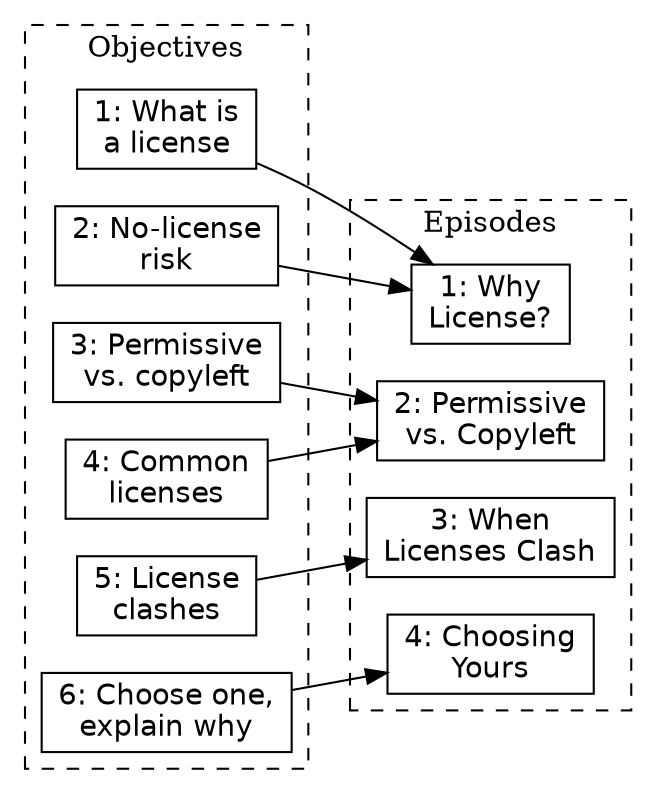
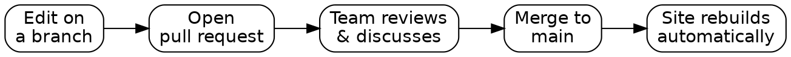

### Day 2, Fri 8/28, 9:00am-5:00pm PT sharp

Hard stop at 5:00, no extra day. Sessions recorded if you have to step out.

---

### Yesterday, briefly

* Backward design: audience → outcomes → assessments → content → assess → evaluate
* Landed on a target audience: people who already write/host code but don't know licensing, the same folks who show up at OSPO intake with a project already in hand
* Drafted and peer-reviewed lesson-level objectives. Laura's synthesis (6 objectives) is a strong, group-vetted starting point for today
* Started narrative threads overnight: several independent ideas already converging on the same shape

Note:

* This isn't generic recap filler. The group did real work yesterday. Naming it specifically (their actual audience, their actual objectives) signals today builds directly on that, not from scratch.

---

### Today

| Time (PT) | Block |
|---|---|
| 9:00 | Start / yesterday recap |
| 9:00-9:20 | Share Narrative Threads |
| 9:20-10:25 | Episodes |
| 10:25-10:40 | *Break* |
| 10:40-12:00 | Designing Exercises |
| 12:00-1:00 | *Lunch* |
| 1:00-2:10 | The Carpentries Workbench |
| 2:10-2:25 | *Break* |
| 2:25-3:30 | Adding Lesson Content |
| 3:30-3:55 | Wrap-up |
| 3:55-5:00 | End early / buffer |

Note:

* **We're doing less today, on purpose.** Three full episodes are cut entirely, not just trimmed: How We Operate, Preparing to Teach, and How to Write a Lesson. All three move to standing Tuesday meetings over the coming weeks. Full content for each is in the appendix when you're ready to cover it.
* **~325 min of scheduled content against the 480-min (9-5) window**, leaving about 65 min of real slack at the end. That's not padding to fill, it's genuine room to end early if the day goes well. Don't reach for appendix content to fill it; ending early is the better outcome.
* If a block runs long, that time comes out of the end-of-day slack, not out of lunch (fixed noon-1:00, don't push it) or out of the two built-in breaks.
* **Workbench + Adding Content stays intact at 135 min.** The one block that can't be shortcut, since it's where the actual repo gets built.

---

### Share Your Narrative Threads (15-20 minutes)

Each team: share the candidate narrative/use-case thread from overnight. Not a finished answer, just something to react to as a group.

Note:

* This isn't a formally timed segment in the source curriculum. It's specific to how we split Narrative across the overnight gap. Keep it tight; the real clock pressure starts now.

---

**What You Each Proposed Overnight**

* **Jose**: structured multi-episode approach: intro example group, ask what they should do about licensing, walk through consequences, then common licenses one by one. A second episode repeats it with a different context. Final exercise: choose for a new scenario.
* **Laura**: 2-3 fictional maintainer personas (researcher, student, IT staff), each confused about which license to pick.
* **Karla**: two contrasting researcher scenarios: full open-source release vs. partial ("COSS") release.
* **Reid**: writing code is necessary for most research projects sharing data or code, a possible opening motivation rather than a separate scenario.

---

**These Aren't Competing, They're the Same Shape**

Persona-based scenarios illustrating different licensing situations, run through the episode structure Jose outlined.

Open for today:
* How many personas: 2 or 2-3?
* Throughline: full-vs-partial release (Karla), or personas varying by role (Laura)?
* Does Reid's "why does this audience need this lesson" fit as the opener?

Note:

* Worth naming out loud if the group is stuck synthesizing: point out this convergence rather than starting from zero. The IP-ownership fork Laura mentioned (UC-owned code routes to TTO) is a real-world detail worth a call-out but is a scope decision, not something to resolve in this 15-20 min slot.

---

### Episodes _(target start: 9:20)_

#### Breaking a Lesson into Episodes

* Rather than one long document, break your lesson into chunks, like chapters in a book or episodes in a TV season
* Each episode should be self-contained (20-60 minutes of content) but contribute to the whole
* Helps manage cognitive load and makes it easy to schedule breaks

---

**Planning Your Episodes**

Use your lesson-level objectives to plan episode count and order. Aim for roughly one episode per objective, or group related objectives into one episode.

Ask yourselves:
* What new knowledge/skills do learners need before they can hit the overall objectives?
* What order should these be introduced in? Are some dependent on others?
* Can complex concepts be broken down further?

---

**Worked Example: Your Objectives → Episodes**

Laura's 6-objective synthesis from yesterday, grouped into 4 candidate episodes:

Note:

* This is a starting point, not the answer. The team should feel free to regroup, split, or reorder. But having a concrete grouping already on screen means the exercise starts from "react to this" instead of a blank page.
* Natural fit with the persona narrative: Episode 4's capstone decision exercise is exactly where a persona/example scenario pays off: "given [persona]'s project, which license and why?"
* If the group's actual narrative threads suggest a different order (e.g. leading with a real clash scenario to motivate the whole lesson), that's a legitimate alternative. Don't force this grouping if their story wants something else.

---

**Exercise: Defining Episodes for a Lesson (25 minutes)**

With your team, in your shared notes:

1. Divide your lesson into logical episode-sized blocks (20-60 min each)
2. Assign one episode to each collaborator

**We strongly recommend assigning yourselves consecutive episodes at the beginning of the lesson.**

---

**Defining Episode-level Objectives**

Now write objectives for your individual episode, same SMART approach as your lesson-level objectives.

* Aim for 2-4 objectives per episode
* Identify which lesson-level objective(s) your episode supports

---

**Exercise: define objectives for your episode (30 minutes)**

1. Write SMART objectives for your chosen episode (15 min)
2. Compare with your collaborators: any gaps or overlaps?
3. As a group, resolve any problems and edit accordingly

---

### *Break* _(target: 10:25)_

---

### Designing Exercises _(target start: 10:40)_

---

**Summative vs. Formative Assessment**

* **Summative**: used *after* instruction to verify learning (exams, certificates). Not usually a fit for short courses.
* **Formative**: used *during* instruction, moves new information into long-term memory, lets instructors adjust pace and address misconceptions in real time.

For short courses like ours, formative assessment does almost all the work.

---

**Formative assessment tools**

* Checking in, Zoom reactions, sticky notes, "pace too fast/slow"
* Group discussion, think/pair/share
* Problem-solving or diagnostic exercises (e.g. multiple choice)
* Individual guided reflection

---

**Exercise: Formative Assessments in this Training (5 min)**

Look back through the training so far. Identify two examples of formative assessment your Trainer has used, and what objective each was checking.

---

**Exercise: Exercise Types and When to Use Them (15 minutes)**

Your group gets assigned an exercise type. Read about it, then discuss:
* What skills would this type assess (action verbs)?
* Better fit for novice or more advanced learners?
* Better for live workshop or self-directed/virtual learning?

Read the type assigned to you in [_Is This a Trick Question?_](https://teachtogether.tech):
* multiple choice (p. 13)
* true-false (p. 20-21)
* fill-in-the-blank (p. 34)
* authentic assessment (p. 46-47)

Note:

* **Use the non-coding branch of this exercise, not the coding branch.** The source episode splits this exercise by lesson type: a coding-lessons branch (multiple choice, fill-in-the-blank, faded examples, Parsons problems, minimal fix, from *Teaching Tech Together*) and a non-coding branch (multiple choice, true-false, fill-in-the-blank, authentic assessment, from *Is This a Trick Question?*). Licensing has no code, so use the non-coding branch above. Faded examples and Parsons problems specifically don't apply here.

---

**Detecting Misconceptions**

Correcting a misconception is as important as presenting new information, a broken mental model actively resists new knowledge until it's fixed.

Well-designed multiple choice questions can diagnose misconceptions directly: each wrong answer should represent a plausible, real misconception, not just an obviously-wrong distractor.

Note:

* Licensing is a misconception-rich domain: "no license means public domain," "permissive means I can do literally anything," "copyleft is 'viral' and infects anything nearby" are all common, all wrong, and exactly the kind of thing a well-built MCQ's wrong-but-plausible answers can catch.
* This is the framing to carry into the next exercise: design wrong answers around a real misconception your target audience is likely to hold, not just any incorrect statement.

---

**Exercise: Assessing Progress Towards an Objective (30 minutes)**

Using one of the exercise formats you just learned about, design an exercise that assesses one of your episode-level objectives.

Given the clock, work together on **one shared exercise** rather than splitting up. The curriculum allows either approach.

---

### *Lunch* _(target: 12:00-1:00)_

---

### The Carpentries Workbench _(target start: 1:00)_

At this stage you're clear on audience, objectives, and your episode outline. Time to build the site.

Note:

* Trainer: demo the default rendered site before editing config.yaml, and step through the GitHub web editor live for anyone unfamiliar with it

---

**GitHub Pages + The Carpentries Workbench**

Lesson sites are built with `{sandpaper}` + `{varnish}` + `{pegboard}` (the Workbench), hosted via GitHub Pages.

| Task | Frequency |
|---|---|
| Create repository | Once |
| Add collaborators | Rarely |
| Edit global config | Rarely |
| Create a new episode | Often early, rarely later |
| Edit episode content | Often |

---

**Creating Your Lesson Repository**

**A QUICK CHECK:** Are you in the [UC-OSPO-Network](https://github.com/UC-OSPO-Network) org? Team access is already staged (`licensing-and-copyright`).

**You're one team building one lesson: only one person creates the repo, not each of you separately.**

Two templates:
* [Markdown template](https://github.com/carpentries/workbench-template-md/generate): **this one, for Licensing** (no code/data)
* [R Markdown template](https://github.com/carpentries/workbench-template-rmd/generate): skip, not relevant here

**HANDS-ON.** One volunteer: use this template, name the repo, check "Include all branches," Public visibility.

Then: add the new repo to the `licensing-and-copyright` team (org Settings → Teams → licensing-and-copyright → Repositories, or from the repo's own Settings → Collaborators and teams). That gives everyone access at once. Skip the curriculum's "Add collaborators" step; it's written for personal-account repos, not org-team ones.

---

Note:

* Paste the repo URL and rendered site URL into the shared CodiMD notes once, there's only one, not one per person.
* If two people accidentally create separate repos before this lands, pick one and archive/delete the other rather than trying to merge them.

---

**Practice with `config.yaml` (5 minutes)**

Complete these fields, quoted FIXMEs get quoted replacements, unquoted stay unquoted:
* `contact`: an email people can reach with questions
* `created`: today's date, YYYY-MM-DD
* `keywords`: short comma-separated list, include `lesson`, `pre-alpha`
* `source`: your lesson repo's URL

We'll revisit `life_cycle` and `carpentry` fields later.

---

**Improving the README.md (5 minutes)**

Update with:
* the lesson title
* a short description
* author names, optionally linked to GitHub profiles

---

### *Break* _(target: 2:10-2:25)_

---

### Adding Lesson Content _(target start: 2:25)_

---

**Lesson Home Page (`index.md`)**

Replace the template text with your lesson's short description (same as README), then add your lesson objectives as a bullet list.

**Exercise: more practice editing Markdown in GitHub**: add your objectives to `index.md`.

---

**Proposing Changes with Pull Requests**

So far we've edited `main` directly. PRs add quality control, room for discussion, and prevent conflicting simultaneous edits.

Next: add your prerequisites list to `index.md`, this time via a PR: commit to a new branch, open the PR, review, merge.

Note:

* **Instructor judgment call:** if everyone's already comfortable opening PRs, skip the full walkthrough here, check in with the group first. This is an explicit skip point in the source curriculum, not something to assume by default for this cohort.
* The diagram is there for whoever's less git-fluent, point at it once, then move to the hands-on part rather than re-explaining verbally.

---

**Fenced Divs**

Structural blocks rendered distinctly on the page, `::: keyword` ... `:::`, at least 3 colons.

**Practice with Pull Requests (10 min)**, wrap your prerequisites list in a `prereq` fenced div, via a PR.

---

**Creating a New Episode**

Copy `introduction.md`'s header structure, create a new file in `episodes/` named for your topic (e.g. `attribution-requirements.md`), set `teaching`/`exercises` to 0 for now, fill in your questions/objectives/keypoints.

Then add the filename to `config.yaml`'s `episodes:` list so it appears in navigation.

**Exercise: practice creating episodes (10 min)**, create another episode file + add to navigation, via PR.

Note:

* If two people end up editing the same file at once, that's a real teaching moment for merge conflicts, not a problem to route around. Guide them through: identify the conflict markers, decide which version (or a merge of both) is correct, commit the resolution. Working on separate branches delays conflicts until PR time rather than eliminating them.
* `config.yaml`'s `episodes:` list is the one file all four of you will want to touch around the same time, since everyone's adding their own filename to it. Expect a conflict here specifically. It's a small, low-stakes one to practice resolving.

---

**Adding Exercises**

* `challenge`: a problem to solve
* `discussion`: a topic to discuss (no `solution` div support)
* Nest a `solution` div inside a `challenge` for an expandable answer

**Exercise: Formatting Exercises in a Lesson Site (15 min)**, format the exercise you designed earlier using this structure.

---

**More Fenced Div Types**

* `callout`: important points that shouldn't be skipped
* `spoiler`: optional/tangential content, expandable
* `caution`: pitfalls or things that could cause problems

If time remains: transfer more content from your Lesson Design Notes into the site, or start tabbed content, otherwise this rolls into homework.

---

**Troubleshooting the Lesson Build**

If your site isn't updating: stop editing, check commit history for a red X, look at that diff, ask for help (repo issue or Carpentries Slack), or build locally for faster iteration.

Note:

* **Skip point:** if everyone's builds are green, skip this section entirely.

---

### Wrap-up _(target start: 3:30, hard stop 5:00)_

We've reached the end of live time. Iterative + collaborative: regular feedback refines the lesson, shared effort carries it past the finish line.

---

**What's Next for This Cohort, Specifically**

* Repo access is staged, pick up where you left off any time
* **Standing Tuesday meeting** (last 15-30 min) is your ongoing working session with Tim, covers everything cut from today (How We Operate, How to Write a Lesson, Preparing to Teach) plus checking in on the evolving lesson
* No fixed pilot or Incubator date yet, set your own pace as a team

---

**One Up, One Down (10 minutes)**

Feedback on this training, one thing that worked, one thing that didn't. One point each, try not to repeat what's already been said. I'll record in the CodiMD, not respond live.

---

Good luck, and keep in touch as you build out the lesson!

---
---

## Appendix, Tuesday check-in material (not part of Friday's live flow)

*Everything below was cut from Friday to fit the clock. Work through it during the standing Tuesday meetings over the coming weeks, alongside checking in on how each lesson is evolving.*

---

### Tuesday Check-in Plan, 2:00-2:30pm PT

The `oss-license-workshop` repo is live with a real 4-episode structure (Jose: Why License?, Laura/Jose: Permissive vs. Copyleft, Karla: When Licenses Clash, Reid: Choosing Yours). Each 30-minute check-in pairs one week's real repo work with one appendix section below.

---

**Week 1: Fix what's blocking a working build**

* Rebase PR #5 (episode-2-permissive-vs-copyleft) onto `main`, fix its missing `.md` extension and unclosed challenge/solution divs (Laura, Jose)
* Fix `when-license-clash.md`'s `exercise:` front-matter typo (should be `exercises:`), turn its compatibility grid into a real Pandoc table with a solution (Karla)
* Retitle `choosing-licenses.md` (still says "Using Markdown"), replace its copy-pasted keypoints (Reid)
* Decide: delete or repurpose `introduction.md`, it's unedited scaffold and not even wired into `config.yaml`
* Appendix reference: *How We Operate*, sets the pace and expectations for this check-in series itself

---

**Week 2: Real content for Episodes 1 and 2**

* `why-license.md`: replace placeholder keypoints, add prose for the "license relates to copyright/IP" objective (Jose)
* Episode 2: replace the boilerplate body with real permissive/copyleft/weak-copyleft explanation and a real challenge (Laura, Jose)
* Appendix reference: *How to Write a Lesson*, explanatory-text and language-to-watch-for guidance applies directly here

---

**Week 3: Real content for Episodes 3 and 4, settle the persona**

* `when-license-clash.md`: replace `<!-- EPISODE CONTENT HERE -->` with real explanation, add a solution, real keypoints (Karla)
* `choosing-licenses.md`: turn the three sketched exercise ideas into one real capstone challenge/solution (Reid)
* Resolve the persona/narrative question left open from Friday (2 vs. 2-3 personas, which axis), Episode 4's capstone needs it
* Appendix reference: *How to Write a Lesson*, terminology and episode-metadata exercises

---

**Week 4: Support files**

* Port the glossary from `lesson-design-notes-licensing-draft.md` into `learners/reference.md`
* Simplify `learners/setup.md`, no software/data setup is actually needed for this lesson
* Write real `instructors/instructor-notes.md` and `profiles/learner-profiles.md`
* Appendix reference: *Preparing to Teach*, its setup/instructor-notes/feedback-plan exercises map directly to these files

---

**Week 5+: Toward a pilot**

* Re-run the `carpentries-workbench-checker` tool against the repo, confirm the Week 1-4 fixes cleared its findings
* Plan a pilot workshop, decide when to bump `life_cycle` past `pre-alpha`

---

### How We Operate (full) _(Tuesday Week 1)_

---

**The Lesson Life Cycle, Revisited**

* pre-alpha/alpha/beta happen in **The Carpentries Incubator**
* Stable, peer-reviewed lessons live in **The Carpentries Lab**
* Life cycle stage is set in `config.yaml`'s `life_cycle` field, leave at `pre-alpha` for now

---

**Pathways Out of Incubation**

1. Join an existing lesson program (Library Carpentry, etc.), pending Curriculum Advisory Committee review
2. Submit to **The Carpentries Lab** for open peer review, with the option to publish in JOSE

No fixed timeline for this yet, pace is set by your group.

---

**Pilot Workshops**

*"No lesson survives first contact with learners.", Greg Wilson*

Track during your pilot: time per section/exercise, technical issues, questions asked, confusing parts. The [pilot workshop notes template](https://codimd.carpentries.org/lesson-pilot-observation-notes-template#) helps, assign one team member to observe and take notes.

---

**Connecting with the Community**

* `lesson-dev` channel, [Carpentries Slack](https://slack-invite.carpentries.org/)
* [`incubator-developers`](https://carpentries.topicbox.com/groups/incubator-developers) mailing list
* GitHub Skill-up sessions, included in your training, recommended if you're newer to collaborative GitHub

---

### How to Write a Lesson (full, deferred) _(Tuesday Weeks 2-3)_

---

**Writing Explanatory Text**

Explanatory text is the train track connecting your exercises. It lets other instructors and self-directed learners follow along, and helps you stay on track teaching.

Balance: enough detail to meet objectives, not so much it adds cognitive load.

---

**Less is More**

* Trying to fit too much content into a lesson is counter-productive
* Most Carpentries workshops are two work-days of material
* Assume you're under-estimating time, not over-estimating: better to have extra time than rush
* If cutting content after a pilot: remove whole objectives (and their assessments/content), not just trim text

---

**Language to Watch For**

* Dismissive language ("simply," "just")
* Stereotypes
* Expert awareness gaps: assuming learners know more than they do
* Inconsistent terminology for the same thing
* Unexplained jargon, unexplained assumptions, sudden difficulty jumps

---

**Accessibility**

* Avoid regional/cultural idioms and contractions
* Alt text for all figures/images
* No h1 headers in the lesson body, no skipped heading levels
* Descriptive link text: no "click here"
* Check text/foreground contrast

---

**Exercise: Examples Before Exercises (20 minutes)**

Looking at an exercise you designed earlier: what worked example could you include in your narrative to prepare learners for it? Outline it in your Lesson Design Notes.

---

**Discussion: Lesson Time Management (10 minutes)**

In your shared notes: when has too much material for the time available happened to you? How did facilitators handle it? What's the tradeoff of breaking a lesson into smaller chunks over more time?

---

**Optional Exercise: Alt Text for Images (5 minutes)**

Given a chart of rising CO2 at Mauna Loa, which caption is the best alt text, vague, moderately descriptive, or a full data dump? *(Answer: moderately descriptive, type of plot, what's measured, the trend. Not a data dump.)*

---

**Exercise: Explain Your Terminology (5 min)**, list terms/jargon from your lesson with definitions, in your shared notes.

**Exercise: Completing episode metadata (10 min)**, add keypoints and questions for your episode.

---

### Preparing to Teach (full, deferred to standing meetings before your pilot) _(Tuesday Week 4)_

---

**Teaching Plan**

Outlines your session: welcome/motivation, setup check, teaching + exercise segments, checkpoints, visual aids, references.

**Checkpoints** are especially useful early on, pause to confirm everyone has what they need before moving on.

**Exercise: Prepare a teaching plan (15 minutes)**: bullet-point notes on what you'll say and do teaching the episode you've been focused on. Can go straight into your Lesson Design Notes doc.

---

**Setup Instructions**

If your lesson needs any software/tools/data, write clear setup instructions now, saves time at your pilot. Lives in `learners/setup.md`.

**Exercise: Add Setup Instructions (10 min)**

---

**Instructor Notes**

Lives in `instructors/instructor-notes.md`, visible in "Instructor View" only. Good candidates:
* rationale, strengths/weaknesses of the design
* what worked / didn't in early drafts
* teaching tips, tricky points
* common troubleshooting

**Exercise: Add Instructor Notes (5 min)**, add initial notes, plus one inline `instructor` fenced div in an episode.

---

**Hidden Curriculum**

What learners pick up from *how* a lesson is taught, not just its content, unofficial norms and values transferred, often unconsciously. Use Instructor Notes to flag tried-and-tested practices for other instructors to follow.

---

**Feedback Collection Plan**

Assign feedback-collection roles ahead of your pilot, this is the most important part of your teaching plan.

* Constantly, throughout: observer notes ([pilot notes template](https://codimd.carpentries.org/lesson-pilot-observation-notes-template#)), or minute-card feedback ([virtual minute card template](https://docs.google.com/forms/d/1rsGrY-COjGt-paQQjmTyr7Ic4iw7aNYQkBcMLHrQU0k/template/preview?pli=1))
* Designated wrap-up session, a [post-workshop survey](https://docs.google.com/forms/d/1OGCQBotD2nOJkc7KpFZLhFfb3EBcxEDwHz_3p48qz3U/template/preview) as a starting point

---

**After the Training**

Two checkout tasks for Lesson Developer certification:

1. Teach one or more episodes to a real audience
2. Join a *Pilot Workshop Debrief* session

---

**Discussion: What questions do you have? (15 minutes)**

About the checkout/pilot process, what's unsure, what resources might help.
